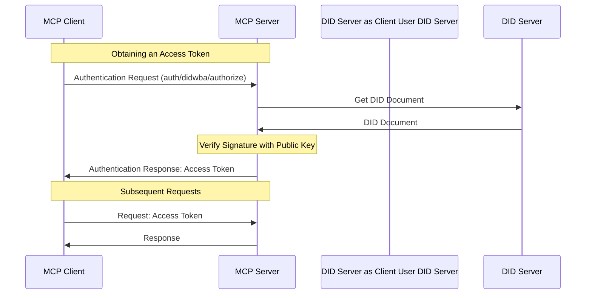


Auth is **experimental**, and being drafted for release in the next [revision]() of the protocol.

The additions to the base protocol are backwards compatible to revision 2024-11-05; however, **the auth specification may change in backwards incompatible ways** until the next protocol revision.


The Model Context Protocol (MCP) supports [did:wba](https://github.com/chgaowei/AgentNetworkProtocol/blob/main/03-did%3Awba%20Method%20Design%20Specification.md) as a standardized authentication method, allowing secure authorization flows between clients and servers. Tokens will be securely communicated as part of the request body.

## Protocol Flow
We follow the flows defined by [did:wba method specification](https://github.com/chgaowei/AgentNetworkProtocol/blob/main/03-did%3Awba%20Method%20Design%20Specification.md#4-cross-platform-identity-authentication-process-based-on-didwba-method-and-json-format-data) .



## Capabilities

Clients supporting did:wba **MUST** declare it during initialization:

```json
{
  "capabilities": {
    "auth": {
      "didwba": true
    }
  }
}
```

Servers supporting did:wba **MUST** include their capabilities:

```json
{
  "capabilities": {
    "auth": {
      "didwba": {
        "authorize": true,
        "revoke": true
      }
    }
  }
}
```

## Flows
### Initialization
During initialization, if the client and server both support the `didwba` capability, the client **SHOULD** include an access token in all subsequent requests. If the client does not have an access token, the client **SHOULD** obtain one.

### Obtaining an Access Token

To obtain an access token, clients **MUST** send an `auth/didwba/authorize` request.

**Request:**
```typescript
{
  "jsonrpc": "2.0",
  "id": 1,
  "method": "auth/didwba/authorize",
  "params": {
    "did": "did:wba:example.com%3A8800:user:alice", // REQUIRED
    "nonce": "abc123", // REQUIRED
    "timestamp": "2024-12-05T12:34:56Z", // REQUIRED
    "verificationMethod": "key-1", // REQUIRED
    "signature": "base64url(signature_of_nonce_timestamp_service_did)" // REQUIRED
  }
}
```

**Response:**
```json
{
  "jsonrpc": "2.0",
  "id": 1,
  "result": {
    "access_token": "access_token"
  }
}
```

- Request and response fields are defined in the [did:wba method specification](https://github.com/chgaowei/AgentNetworkProtocol/blob/main/03-did%3Awba%20Method%20Design%20Specification.md#4-cross-platform-identity-authentication-process-based-on-didwba-method-and-json-format-data).
- The client **MUST** securely store the access token.
- The server **MUST** implement rate-limiting to prevent abuse.

### Utilizing an Access Token

Once a client has obtained an access token, it **SHOULD** include it in all requests in the parameters, including the initalization request.

**Request:**

```json
{
  "jsonrpc": "2.0",
  "id": 1,
  "method": "...",
  "params": {
    "_meta": {
      "auth": {
        "didwba": {
          "access_token": "..."
        }
      }
    }
  }
}
```

### Handling Expired Tokens

If the access token is expired, the MCP server **MUST** respond with an error response with code `401` , and the message **SHOULD** be `Access token expired`.

**Access Token Expired Response:**
```typescript
{
  jsonrpc: "2.0";
  id: 1;
  error: {
    code: 401;
    message: "Access token expired";
  }
}
```

The client receives the error response, **SHOULD** obtain a new access token as if the user was authenticating for the first time.

### Revoke Token Flow

**Request:**

```json
{
  "jsonrpc": "2.0",
  "id": 1,
  "method": "auth/didwba/revoke",
  "params": {
    "access_token": "access_token"
  }
}
```

## Error Handling
### Error Responses
If a request failed client authentication or is invalid the server should respond with an error response as described in [Section 4.2.2 of did:wba method specification](https://github.com/chgaowei/AgentNetworkProtocol/blob/main/03-did%3Awba%20Method%20Design%20Specification.md#422-error-handling).

**Response:**
```typescript
{
  "jsonrpc": "2.0",
  "id": 1,
  "error": {
    "code": -32001,
    "message": "Auth error, please see nested data.",
    "data": {
      "authRequest": {
        "didwba": {
          "error": "ASCII error code from 4.2.2", // REQUIRED
          "error_description": "Helpful message", // OPTIONAL
        }
      }
    }
  }
}
```
Clients **SHOULD** handle errors as gracefully as possible and presenting errors clearly.


### Server Guidelines

## Security Considerations

Implementers should consider the following security aspects:

- Private keys corresponding to DIDs must be securely stored and protected from exposure. Additionally, establish a mechanism for periodic key rotation.
- Servers must track request nonces to prevent replay attacks.
- Servers must validate request timestamps to prevent time rollback attacks. Generally, the server's nonce cache duration should exceed the timestamp expiration period.
- Servers should use DNS-over-HTTPS (DoH) protocol when retrieving DID documents to enhance security.
- Transport protocols must use HTTPS, and clients must strictly validate the server's CA certificate trustworthiness.
- Both client and server must securely manage Access Tokens and set appropriate expiration times.
- It is recommended to include additional security information in Access Tokens, such as client IP binding and User-Agent binding, to prevent token misuse.
- Users can generate multiple DIDs, each with different roles and permissions using different key pairs, to implement fine-grained access control.

   