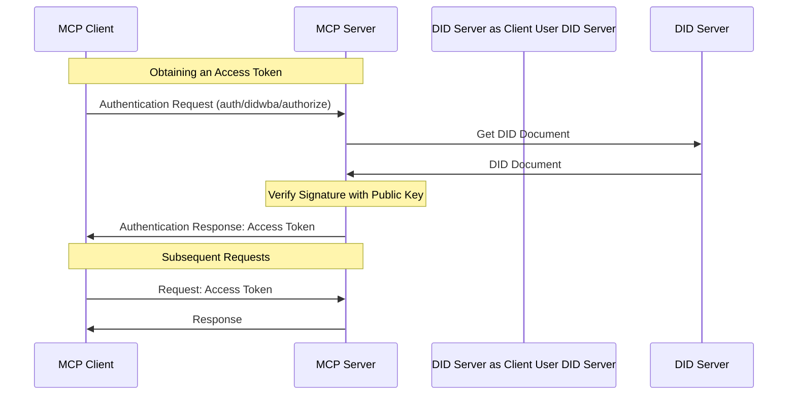


Auth is **experimental**, and being drafted for release in the next [revision]() of the protocol.

The additions to the base protocol are backwards compatible to revision 2024-11-05; however, **the auth specification may change in backwards incompatible ways** until the next protocol revision.


The Model Context Protocol (MCP) supports [did:wba](https://github.com/chgaowei/AgentNetworkProtocol/blob/main/03-did%3Awba%20Method%20Design%20Specification.md)  as an experimental authentication method, allowing secure authorization flows between clients and servers. Tokens will be securely communicated as part of the request body.

The did:wba method is a draft method specification under the W3C Decentralized Identifiers (DIDs) standard. The [W3C DIDs](https://www.w3.org/TR/did-core/) standard, published as a W3C Recommendation in 2022, is a new type of identifier that enables verifiable, decentralized digital identity. DIDs have been widely adopted by many applications, such as Bluesky. The wba method leverages mature web infrastructure to design a decentralized authentication approach. It supports both decentralized characteristics and large-scale user adoption. Its authentication flow is simpler than OAuth 2.0 while maintaining equivalent security.

## Protocol Flow
We follow the flows defined by [did:wba method specification](https://github.com/chgaowei/AgentNetworkProtocol/blob/main/03-did%3Awba%20Method%20Design%20Specification.md#4-cross-platform-identity-authentication-process-based-on-didwba-method-and-json-format-data) .



## Capabilities

Servers supporting did:wba **MUST** include their capabilities:

```json
{
  "capabilities": {
    "experimental": {
      "auth": {
        "didwba": {
          "authorize": {},
          "revoke": {}          
        }
      }
    }
  }
}
```

## Flows
### Initialization
During initialization, if the server supports the `didwba` capability and the client also chooses to use `didwba` for authentication, the client **SHOULD** include a `didwba` access token in all subsequent requests. If the client does not have a `didwba` access token, the client **SHOULD** obtain one.

### Obtaining an Access Token

To obtain an access token, clients **MUST** send an `auth/didwba/authorize` request.

**Request:**
```typescript
{
  "jsonrpc": "2.0",
  "id": 1,
  "method": "auth/didwba/authorize",
  "params": {
    "did": "did:wba:example.com%3A8800:user:alice", // REQUIRED
    "nonce": "abc123", // REQUIRED
    "timestamp": "2024-12-05T12:34:56Z", // REQUIRED
    "verification_method": "key-1", // REQUIRED
    "signature": "base64url(signature_of_nonce_timestamp_service_did)" // REQUIRED
  }
}
```

**Response:**
```json
{
  "jsonrpc": "2.0",
  "id": 1,
  "result": {
    "access_token": "access_token"
  }
}
```

- Request and response fields are defined in the [did:wba method specification](https://github.com/chgaowei/AgentNetworkProtocol/blob/main/03-did%3Awba%20Method%20Design%20Specification.md#4-cross-platform-identity-authentication-process-based-on-didwba-method-and-json-format-data).
- The client **MUST** securely store the access token.
- The server **MUST** implement rate-limiting to prevent abuse.

### Utilizing an Access Token

Once a client has obtained an access token, it **SHOULD** include it in all requests in the parameters, including the initalization request.

**Request:**

```json
{
  "jsonrpc": "2.0",
  "id": 1,
  "method": "...",
  "params": {
    "_meta": {
      "auth": {
        "didwba": {
          "access_token": "..."
        }
      }
    }
  }
}
```

### Revoke Token Flow

**Request:**

```json
{
  "jsonrpc": "2.0",
  "id": 1,
  "method": "auth/didwba/revoke",
  "params": {
    "access_token": "access_token"
  }
}
```

## Error Handling
### Error Responses
If a request failed client authentication or is invalid the server should respond with an error response as described in [Section 4.2.2 of did:wba method specification](https://github.com/chgaowei/AgentNetworkProtocol/blob/main/03-did%3Awba%20Method%20Design%20Specification.md#422-error-handling).

**Response:**
```typescript
{
  "jsonrpc": "2.0",
  "id": 1,
  "error": {
    "code": -32001,
    "message": "Auth error, please see nested data.",
    "data": {
      "authRequest": {
        "didwba": {
          "error": "ASCII error code from 4.2.2", // REQUIRED
          "error_description": "Helpful message", // OPTIONAL
          "error_uri": "Helpful webpage" // OPTIONAL
        }
      }
    }
  }
}
```
Clients **SHOULD** handle errors as gracefully as possible and presenting errors clearly.


### Server Guidelines

## Security Considerations
   
Implementers need to consider the following security issues when implementing:

1. Key Management
- The private key corresponding to the DID **must** be properly kept and never leaked. Additionally, a regular refresh mechanism for private keys **should** be established.
- Users **should** generate multiple DIDs, each with different roles and permissions, using different key pairs to achieve fine-grained access control.

2. Anti-Attack Measures
- The server **must** keep a record of the Nonce in requests to prevent replay attacks.
- The server **must** check the timestamp in requests to prevent time rollback attacks. Generally, the server's nonce cache duration **should** be longer than the timestamp expiration duration.
- When generating a Nonce, **must** use a secure random number generator provided by the operating system to meet modern cryptographic security standards and norms. For example, you can use a module like Python's `secrets` to generate secure random numbers.

3. Transport Security
- When retrieving DID documents, the server **should** use the DNS-over-HTTPS (DoH) protocol to enhance security.
- The transport protocol **must** use HTTPS, and clients **must** strictly verify whether the CA certificate of the other party is trustworthy.

4. Token Security
- Both client and server **must** properly keep the Access Token and **must** set a reasonable expiration time.
- **Should** include additional security information in the Access Token, such as client IP binding, User-Agent binding, etc., to prevent token abuse.

